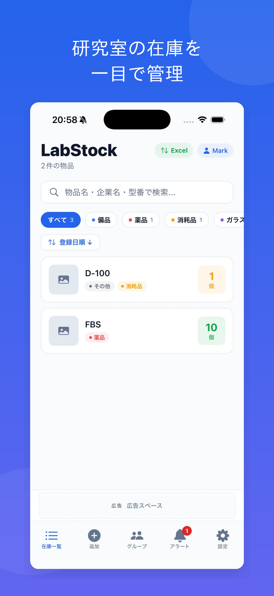
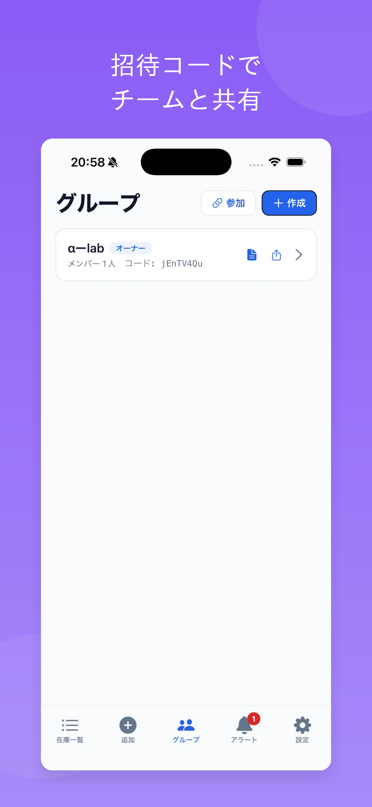
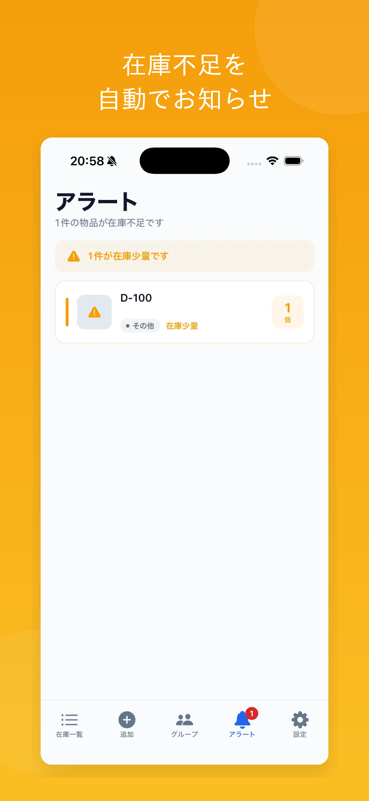

# LabStock — 研究室の在庫管理アプリ

研究室の備品・薬品・消耗品の在庫を、バーコードスキャンやチーム共有で効率的に管理できる iOS アプリです。在庫切れによる研究の遅延を防ぎ、複数人での在庫管理を簡単にすることを目的としています。

<p>
  
  
  
</p>

## 主な機能

- 📦 **在庫管理** — 物品名・企業名・型番・個数・保管場所・画像を登録、検索・並び替え
- 📷 **バーコード / QR スキャン** — カメラで読み取って素早く登録
- 🏷 **カテゴリ（タグ）** — プリセット＋自由記述で分類し、絞り込み
- 🔔 **在庫アラート** — 物品ごとに閾値を設定し、在庫不足を通知
- 📝 **変更ログ** — 誰が・いつ・いくつ変更したかを自動記録
- 👥 **グループ共有** — 招待コードで複数端末から同じ在庫を共有（Supabase バックエンド）
- 📊 **Excel エクスポート** — 在庫状況を .xlsx で出力
- 🌙 **ダークモード対応**

## 技術スタック

| 領域 | 採用技術 |
|------|----------|
| フレームワーク | React Native 0.81 / Expo SDK 54（New Architecture） |
| 言語 | TypeScript |
| ルーティング | Expo Router（ファイルベースルーティング） |
| スタイリング | NativeWind（Tailwind CSS） |
| ローカル保存 | AsyncStorage |
| バックエンド | Supabase（PostgreSQL / RPC / Row Level Security） |
| 広告 | Google AdMob |
| その他 | expo-camera, expo-image-picker, expo-notifications, xlsx |

## アーキテクチャ

- **個人の在庫**は端末内（AsyncStorage）に保存し、オフラインで動作。
- **グループ共有**は Supabase（PostgreSQL）上に保存。ログイン不要で、端末ごとに生成する UUID と招待コードでメンバーを識別する設計。
- **セキュリティ**：全テーブルで Row Level Security を有効化して直接アクセスを遮断。操作はメンバーシップを検証する `SECURITY DEFINER` の RPC 関数経由でのみ可能（[`supabase/migrations/0001_init_groups.sql`](supabase/migrations/0001_init_groups.sql)）。anon キーがクライアントに埋め込まれても、自分が参加したグループ以外は読み書きできない。

```
app/            画面（Expo Router）
  (tabs)/       在庫一覧・追加・アラート・グループ・設定
  group/[id]    グループ詳細
components/      UI コンポーネント（ホイールピッカー等）
lib/             ストレージ・Supabase クライアント・バリデーション等
supabase/        DB マイグレーション（テーブル定義＋RPC＋RLS）
```

## セットアップ

```bash
pnpm install
cp .env.example .env        # Supabase の URL と anon キーを設定
npx expo start             # Expo Go または開発ビルドで起動
```

グループ共有を使う場合は、Supabase の SQL Editor で [`supabase/migrations/0001_init_groups.sql`](supabase/migrations/0001_init_groups.sql) を実行してください（詳細は [`supabase/README.md`](supabase/README.md)）。

## ライセンス

個人開発プロジェクト。
